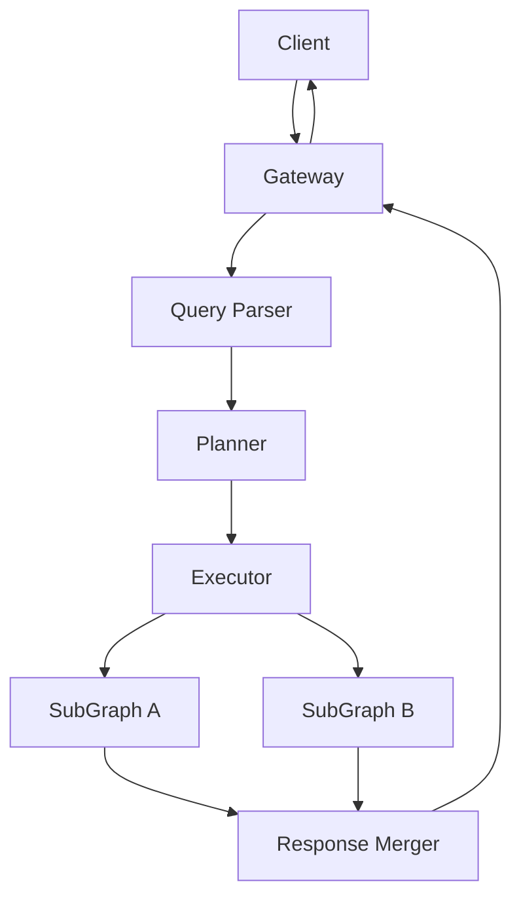
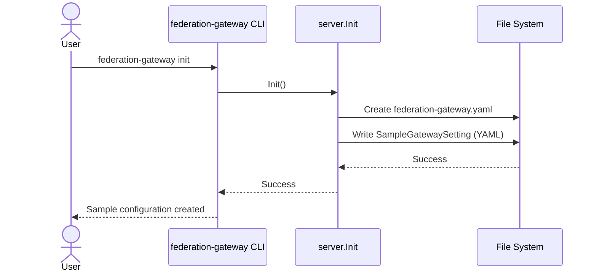
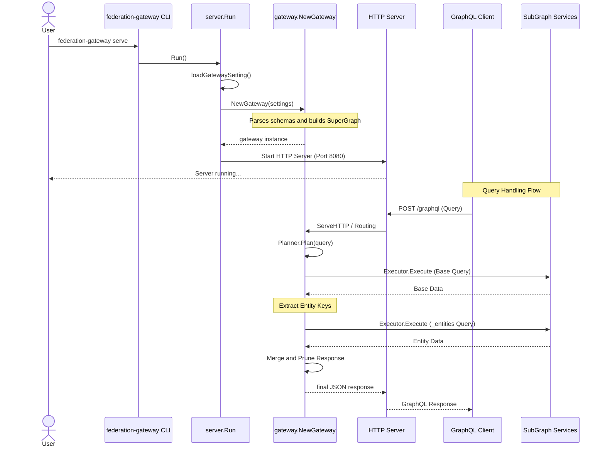

## Author
[Your Name/Team Name]

## Summary
`federation-gateway` is a GraphQL federation gateway implementation in Go. It allows multiple independent GraphQL services (subgraphs) to be composed into a single unified GraphQL API (supergraph). The gateway is responsible for routing client queries to the appropriate subgraphs, orchestrating data fetching across services, and merging the results into a single response.

## Spec
- **Schema Composition**: Merges multiple subgraph schemas into a single SuperGraph schema using `goliteql`.
- **Federation Directives**: Supports Apollo Federation-style directives such as `@key`, `@external`, and `@extend` to define field ownership and entity relationships across subgraphs.
- **Query Execution**:
    - Parses incoming GraphQL queries.
    - Generates an execution plan consisting of sequential and parallel steps.
    - Supports `_entities` queries to fetch data for extended types.
- **Configuration**: Managed via a YAML file (`federation-gateway.yaml`) specifying subgraph names, hosts, and schemas.
- **CLI Interface**: Built with Cobra, providing commands like `serve` to start the gateway and `init` to generate sample configuration.

## Architecture
The project is structured into several core packages:

- **`gateway`**: The main entry point for the gateway logic. It implements `http.Handler` and coordinates the parsing, planning, and execution phases.
- **`federation/graph`**: Manages the `SuperGraph` and `SubGraph` representations. It handles schema parsing and maintains a map of field ownership across subgraphs.
- **`federation/planner`**: Responsible for creating a `Plan`. It analyzes the GraphQL document against the supergraph schema to determine which subgraphs own which fields and identifies dependencies between them.
- **`federation/executor`**: Executes the generated `Plan`. It uses a `QueryBuilder` to generate sub-queries and handles the concurrent execution of steps while respecting their dependencies. It also performs the final merging and pruning of the JSON response.
- **`server`**: Provides the HTTP server implementation, including graceful shutdown and configuration loading.

## Usecase/Request Sequence

### 1. Initialize Project (`init` command)
This use case describes how a user initializes a new federation gateway project with a sample configuration file.

### 2. Start Gateway and Handle Queries (`serve` command)
This use case describes how the gateway starts up, loads subgraphs, and handles an incoming GraphQL query that spans multiple services.

